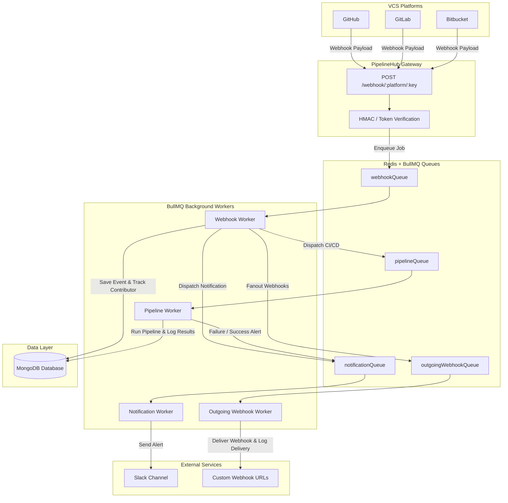

# 🚀 PipelineHub - CI/CD Webhook Gateway & Analytics Engine

A scalable, modular, and asynchronous backend service built with Node.js, Express, MongoDB, Redis, and BullMQ. PipelineHub listens for VCS events (`push`, `pull_request`, `merge`) from GitHub, GitLab, and Bitbucket, securely verifies signatures, tracks contributor analytics, orchestrates CI/CD pipeline runs, dispatches outgoing webhooks, and sends real-time Slack notifications.

> 🌐 **Live Deployment:** [https://pipelinehub.khakse.dev/](https://pipelinehub.khakse.dev/)  
> 📖 **Interactive API Docs (Swagger):** [https://pipelinehub.khakse.dev/api-docs](https://pipelinehub.khakse.dev/api-docs)

---

## 📌 Key Features

* 🛡️ **Multi-Platform VCS Webhook Gateway:** Unified listener for GitHub, GitLab, and Bitbucket events with strict HMAC SHA-256 signature and secret token verification.
* ⚡ **Distributed Queue Architecture:** High-throughput asynchronous background job processing powered by **Redis** and **BullMQ** (Webhook Ingestion, Pipeline Execution, Notification, and Outgoing Webhooks).
* 👥 **Intelligent Contributor Tracking:** 
  * Automatically extracts pusher information from webhook payloads across VCS platforms.
  * Auto-provisions and links user accounts for new contributors on push.
  * Tracks commit frequencies, pull requests, branches, and top contributors per repository.
* 🛠️ **CI/CD Pipeline Engine:** Automated mock build and test runners with project detection (Node.js, Python, etc.) and execution logs saved to MongoDB.
* 📤 **Outgoing Webhook Dispatcher:** Configurable webhook fanout to external endpoints with delivery history and status tracking.
* 📊 **Observability & Analytics Dashboards:**
  * Global and personal webhook activity, delivery rates, and health metrics.
  * Repository contribution breakdowns and contributor history.
* 🔐 **Authentication & OAuth 2.0:**
  * OAuth 2.0 login and repository syncing for GitHub, GitLab, and Bitbucket.
  * JWT-based authentication with secure cookie handling.
  * Password reset workflow powered by EmailJS.
* 🔔 **Slack Notifications:** Real-time event and pipeline execution alerts dispatched to dedicated Slack channels.
* ⏰ **Fault Recovery & Resilience:** Cron-based retry scheduler for transient pipeline execution and delivery failures.
* 🐳 **Docker & Docker Compose Ready:** Multi-container configuration orchestrating the API server, MongoDB, and Redis with a single command.

---

## 🏗️ System Architecture



---

## 🧪 Tech Stack

* **Runtime & Framework:** Node.js (v20+), Express.js (v5)
* **Databases & Cache:** MongoDB (Mongoose), Redis (ioredis)
* **Job Queues & Workers:** BullMQ
* **Security & Authentication:** HMAC SHA-256, JWT (`jsonwebtoken`), `bcrypt`
* **VCS & Integrations:** GitHub REST API, GitLab API, Bitbucket API, Slack Webhooks, EmailJS
* **Testing & Quality:** Jest, Supertest
* **Documentation:** Swagger UI (`swagger-ui-express`, `yamljs`)
* **DevOps & Orchestration:** Docker, Docker Compose, Makefile

---

## 📡 API Overview

Explore full schemas and try requests live on the [Swagger Documentation](https://pipelinehub.khakse.dev/api-docs).

### 1. Webhooks & Pipelines
| Method | Endpoint | Description |
| :--- | :--- | :--- |
| `POST` | `/webhook/:platform/:key` | Ingest webhook from GitHub, GitLab, or Bitbucket (HMAC verified) |
| `GET` | `/webhook/status` | Fetch pipeline status history |

### 2. Contributor & Repository Analytics
| Method | Endpoint | Description |
| :--- | :--- | :--- |
| `GET` | `/analytics/contributors/:repositoryId` | Get top contributors sorted by commit count |
| `GET` | `/analytics/repository/:repositoryId/summary` | Get full contributor breakdown for a repository |
| `GET` | `/analytics/user/:userId/repositories` | Get all repositories a specific user contributed to |
| `GET` | `/analytics/contributor/:userId/:repositoryId` | Get detailed stats for a user on a specific repo |
| `GET` | `/analytics/user` | General user analytics |

### 3. Authentication & OAuth
| Method | Endpoint | Description |
| :--- | :--- | :--- |
| `POST` | `/auth/login` | Email/password login |
| `GET` | `/auth/github`, `/auth/github/callback` | GitHub OAuth authentication |
| `GET` | `/auth/gitlab`, `/auth/gitlab/callback` | GitLab OAuth authentication |
| `GET` | `/auth/bitbucket`, `/auth/bitbucket/callback` | Bitbucket OAuth authentication |
| `GET` | `/auth/me` | Fetch authenticated user profile |
| `POST` | `/auth/forgot` | Trigger password reset email via EmailJS |
| `POST` | `/auth/updatePass` | Set new password with reset token |
| `POST` | `/auth/logout` | Clear session / authentication cookies |

### 4. Repository Management
| Method | Endpoint | Description |
| :--- | :--- | :--- |
| `GET` | `/repo/available/:provider` | List available repositories from connected OAuth provider |
| `GET` | `/repo/list/:userId` | List connected repositories for a user |
| `POST` | `/repo/connect` | Connect a repository and automatically provision webhooks |

### 5. Webhook Observability Panel
| Method | Endpoint | Description |
| :--- | :--- | :--- |
| `GET` | `/webhookPanel/dashboard/summary` | Global delivery summary & metrics |
| `GET` | `/webhookPanel/dashboard/activity` | Global recent activity stream |
| `GET` | `/webhookPanel/dashboard/health` | Global health status & failure rates |
| `GET` | `/webhookPanel/personal-dashboard/summary` | Authenticated user webhook metrics |
| `GET` | `/webhookPanel/webhooks` | Authenticated user configured webhooks |

---

## ⚙️ Setup & Installation

### Prerequisites
* [Node.js](https://nodejs.org/) (v20 or higher)
* [MongoDB](https://www.mongodb.com/) (v6 or higher)
* [Redis](https://redis.io/) (v7 or higher)
* *(Optional)* [Docker](https://www.docker.com/) & Docker Compose

---

### Option A: Local Development Setup

#### 1. Clone the repository
```bash
git clone https://github.com/VoyagerX21/PipelineHub.git
cd PipelineHub
```

#### 2. Install dependencies
```bash
npm install
```

#### 3. Configure environment variables
Create a `.env` file from the provided example:
```bash
cp .env.example .env
```

Fill in the required configuration options in `.env`:
```env
PORT=3000
MONGODB_URI=mongodb://localhost:27017/pipelinehub
REDIS_HOST=localhost
REDIS_PORT=6379

# Security & Secrets
JWT_SECRET=your_jwt_secret_here
WEBHOOK_SECRET=your_webhook_secret_here

# Notifications
SLACK_WEBHOOK_URL=https://hooks.slack.com/services/...

# OAuth Providers
GITHUB_CLIENT_ID=your_github_client_id
GITHUB_CLIENT_SECRET=your_github_client_secret
GITLAB_CLIENT_ID=your_gitlab_client_id
GITLAB_CLIENT_SECRET=your_gitlab_client_secret
GITLAB_REDIRECT_URI=http://localhost:3000/auth/gitlab/callback
BITBUCKET_CLIENT_ID=your_bitbucket_client_id
BITBUCKET_CLIENT_SECRET=your_bitbucket_client_secret
BITBUCKET_REDIRECT_URI=http://localhost:3000/auth/bitbucket/callback

# URLs & EmailJS
FRONTEND_URL=http://localhost:5173
BACKEND_URL=http://localhost:3000
EMAILJS_PUBLIC_KEY=your_emailjs_public_key
EMAILJS_PRIVATE_KEY=your_emailjs_private_key
PUBLIC_DOMAIN=localhost:3000
```

#### 4. Start Redis and MongoDB
Make sure Redis and MongoDB services are running locally on their default ports (`6379` and `27017`).

#### 5. Start the server
```bash
npm run dev
```

The application and workers will be initialized on:
```
http://localhost:3000
```

---

### Option B: Run with Docker Compose

PipelineHub includes a complete multi-container Docker Compose configuration including the API service, MongoDB 6, and Redis 7.

#### Start all services:
```bash
docker compose up -d --build
```
*(Or use `make up`)*

#### Useful Makefile commands:
```bash
make up        # Start all containers in detached mode
make down      # Stop and tear down all containers
make logs      # Tail live logs for all services
make restart   # Restart all containers
make rebuild   # Rebuild application image and restart
```

---

## 📬 Webhook Setup Guide

When connecting repositories to PipelineHub, configure the webhook settings in your VCS provider:

### 🐙 GitHub
1. Navigate to **Repository Settings** → **Webhooks** → **Add Webhook**.
2. **Payload URL:** `https://pipelinehub.khakse.dev/webhook/github/<YOUR_WEBHOOK_KEY>` (or `/webhook/github` if using global secret).
3. **Content type:** `application/json`.
4. **Secret:** Your configured `WEBHOOK_SECRET` or per-webhook key secret.
5. **Events:** Select `Just the push event` or `Let me select individual events` (`Push`, `Pull requests`).

### 🦊 GitLab
1. Navigate to **Project Settings** → **Webhooks**.
2. **URL:** `https://pipelinehub.khakse.dev/webhook/gitlab/<YOUR_WEBHOOK_KEY>`.
3. **Secret token:** Same as `WEBHOOK_SECRET` / key secret.
4. **Trigger events:** `Push events`, `Merge request events`.

### 🪣 Bitbucket
1. Navigate to **Repository Settings** → **Webhooks** → **Add Webhook**.
2. **URL:** `https://pipelinehub.khakse.dev/webhook/bitbucket/<YOUR_WEBHOOK_KEY>`.
3. **Triggers:** `Repository push`, `Pull request Created`, `Pull request Merged`.

---

## 🧪 Testing

### Run Automated Unit Tests
```bash
npm test
```

### Test Webhooks Locally via CLI / Postman
Generate a test HMAC-SHA256 signature for GitHub webhook verification:

```bash
echo -n '{"zen":"Testing PipelineHub"}' | openssl dgst -sha256 -hmac "YOUR_WEBHOOK_SECRET"
```

Send the request:
```bash
curl -X POST http://localhost:3000/webhook/github/default \
  -H "Content-Type: application/json" \
  -H "x-github-event: push" \
  -H "x-hub-signature-256: sha256=<GENERATED_SIGNATURE>" \
  -d '{"zen":"Testing PipelineHub"}'
```

---

## 📁 Project Structure

```
📦 PipelineHub
 ┣ 📂src
 ┃ ┣ 📂config             # MongoDB and Redis connection clients
 ┃ ┃ ┣ db.js
 ┃ ┃ ┗ redis.js
 ┃ ┣ 📂controllers        # Route handlers and business logic
 ┃ ┃ ┣ 📂auth             # OAuth (GitHub, GitLab, Bitbucket) & Local login
 ┃ ┃ ┣ analytics.js
 ┃ ┃ ┣ contributorAnalytics.js
 ┃ ┃ ┣ events.js
 ┃ ┃ ┣ repo.js
 ┃ ┃ ┣ users.js
 ┃ ┃ ┣ webhookController.js
 ┃ ┃ ┗ webhookPanel.js
 ┃ ┣ 📂jobs               # Scheduled cron jobs & recovery routines
 ┃ ┃ ┗ retryFailedEvents.js
 ┃ ┣ 📂middleware         # JWT Authentication & authorization guards
 ┃ ┃ ┗ authMiddleware.js
 ┃ ┣ 📂models             # Mongoose schemas (Users, Events, Contributors, etc.)
 ┃ ┃ ┣ Commit.js
 ┃ ┃ ┣ Contributor.js
 ┃ ┃ ┣ Event.js
 ┃ ┃ ┣ OAuthAccount.js
 ┃ ┃ ┣ PipelineRun.js
 ┃ ┃ ┣ Repository.js
 ┃ ┃ ┣ User.js
 ┃ ┃ ┣ Webhook.js
 ┃ ┃ ┗ WebhookDelivery.js
 ┃ ┣ 📂queues             # BullMQ queue definitions
 ┃ ┃ ┣ notificationQueue.js
 ┃ ┃ ┣ outgoingWebhookQueue.js
 ┃ ┃ ┣ pipelineQueue.js
 ┃ ┃ ┗ webhookQueue.js
 ┃ ┣ 📂routes             # Express route definitions
 ┃ ┃ ┣ analytics.js
 ┃ ┃ ┣ auth.js
 ┃ ┃ ┣ contributorAnalytics.js
 ┃ ┃ ┣ events.js
 ┃ ┃ ┣ repo.js
 ┃ ┃ ┣ users.js
 ┃ ┃ ┣ webhookPanel.js
 ┃ ┃ ┗ webhookRoutes.js
 ┃ ┣ 📂services           # Core domain services (CI runner, webhook dispatchers, contributor tracking)
 ┃ ┃ ┣ ciRunner.js
 ┃ ┃ ┣ contributorService.js
 ┃ ┃ ┣ eventProcessor.js
 ┃ ┃ ┣ githubApiService.js
 ┃ ┃ ┣ notificationService.js
 ┃ ┃ ┣ pipelineEngine.js
 ┃ ┃ ┗ webhookDispatcher.js
 ┃ ┣ 📂utils              # Helper functions (Pusher extraction, HMAC verification, Slack logger)
 ┃ ┃ ┣ extractPusher.js
 ┃ ┃ ┣ projectDetector.js
 ┃ ┃ ┣ slackLogger.js
 ┃ ┃ ┗ verifySignature.js
 ┃ ┣ 📂workers            # BullMQ worker processors
 ┃ ┃ ┣ notificationWorker.js
 ┃ ┃ ┣ outgoingWebhookWorker.js
 ┃ ┃ ┣ pipelineWorker.js
 ┃ ┃ ┗ webhookWorker.js
 ┃ ┗ app.js               # Express application initialization
 ┣ 📂tests                # Jest test suites
 ┃ ┗ verifySignature.test.js
 ┣ .env.example           # Example environment configuration
 ┣ docker-compose.yml     # Multi-container orchestration (App, MongoDB, Redis)
 ┣ Dockerfile             # Alpine-based production container definition
 ┣ Makefile               # Container management shortcuts
 ┣ package.json
 ┣ server.js              # Application entry point & worker bootstrap
 ┗ swagger.yaml           # OpenAPI / Swagger 3.0 specification
```
